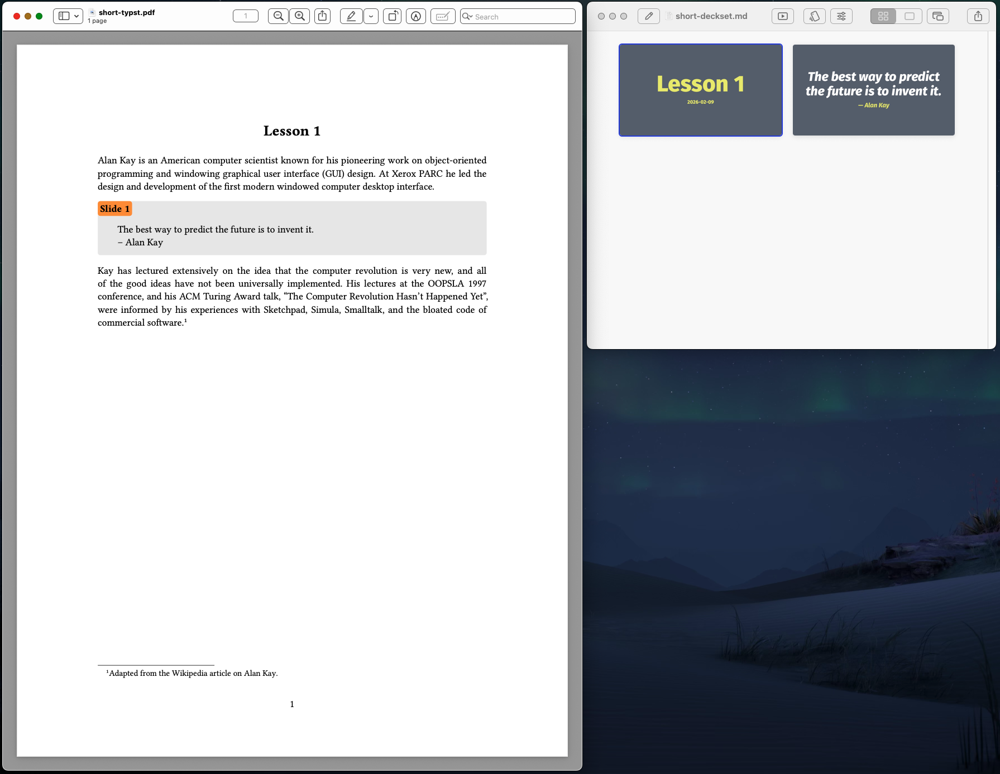

# pandoc-lecturenotes

This is a set of filters for single-source publishing of teaching material, or, in other words, for producing both slides and lecture notes (with or without embedded slides) from a single Markdown source document.  The idea is similar to, e.g., `beamerarticle` but aims to be lightweight; see [pandoc-lecturenotes and the Quest for More Efficient Professoring](https://dynalabs.de/mxp/blog/2025-12-29) for a longer description.

Slides can be produced for any of the slide formats supported by Pandoc—see the [Pandoc User’s Guide](https://pandoc.org/MANUAL.html#slide-shows)—or [Deckset](https://www.deckset.com/)).  Lecture notes (in PDF) can be formatted with LaTeX, Typst, or—with limitations—**ms**.

Within the document, slides are contained in divs with the class `slide`.  Here’s a short example document (`short.md`):

``` markdown

---
title: "Lesson 1"
...

Alan Kay is an American computer scientist known for his pioneering work on object-oriented programming and windowing graphical user interface (GUI) design.  At Xerox PARC he led the design and development of the first modern windowed computer desktop interface.

::: slide

> The best way to predict the future is to invent it.  
-- Alan Kay

:::

Kay has lectured extensively on the idea that the computer revolution is very new, and all of the good ideas have not been universally implemented.  His lectures at the OOPSLA 1997 conference, and his ACM Turing Award talk, “The Computer Revolution Hasn’t Happened Yet”, were informed by his experiences with Sketchpad, Simula, Smalltalk, and the bloated code of commercial software.[^1]

[^1]: Adapted from the Wikipedia article on [Alan Kay](https://en.wikipedia.org/wiki/Alan_Kay).

```

The screenshot below shows lecture notes (with the slide embedded) and the slides.




## Making Slides

For producing slides in the formats natively supported by Pandoc (e.g., reveal.js), use the `native-slides.lua` filter and the desired target format (e.g., `-t revealjs`).  For example, running the following command in this directory will produce the file `short.html` with the presentation in reveal.js:

```
pandoc -s -f markdown -t revealjs -L filters/native-slides.lua -o short-revealjs.html short.md
```

(A better idea is of course to use a Makefile; if you have GNU make installed, you can just say `make short-revealjs.html`.)

The `native-slides.lua` filter should typically come early in the filter pipeline, in any case before `--citeproc`, to avoid references that don’t occur on the slides to appear in the list of references.  The slide blocks can in principle contain any construct supported by Pandoc.

For producing slides for Deckset, use the `deckset-slides.lua` filter with `commonmark+footnotes+pipe_tables+strikeout+tex_math_dollars+hard_line_breaks` as target format.  Again, if you have GNU make installed, you can just say `make short-deckset.md` in this directory.

If you use citeproc, add the `deckset-post-citeproc.lua` filter **after** the `--citeproc` option.  The content of the slide blocks is in Deckset’s Markdown variant, with some extensions and some limitations.

## Making Lecture Notes

For producing lecture notes with embedded slides for formatting with LaTeX, Typst, or **ms**, use the `embed-slides.lua` filter.  The Makefile contains the corresponding rules, so you can say `make short-latex.pdf`, `make short-typst.pdf`, or `make short-ms.pdf`.  You can exclude slides from the notes by adding the `presentation` class, for example:

```
::: {.slide .presentation}
This slide will only appear in the presentation.
:::
```

You can exclude _all_ slides from the lecture notes by setting the `showslides` metadata field to `false`.   You can also exclude images, divs, and code blocks from slides by adding the `lecturenotes` class; for example, this link will only appear in the lecture notes:

```
<https://youtu.be/…>{.lecturenotes}
```

This can be used to explicitly use different images for the presentation and the lecture notes.  But you can also use it, for example, to have Deckset include a video from the filesystem (so you don’t depend on a network connection for the presentation) and to include a YouTube link on the lecture notes.

The `embed-slides.lua` filter aims to produce useful renderings of the slides, but obviously cannot reproduce everything that dedicated presentation software like Deckset or reveal.js does—but this isn’t really the idea.

The filters are compatible with the [`scholarly-metadata` filter](https://github.com/pandoc/lua-filters/tree/master/scholarly-metadata).

## Installation

In order to use the Lua filters (in the `filters` directory), Pandoc must be able to find them.  See the [Pandoc User’s Guide](https://pandoc.org/MANUAL.html#option--lua-filter) for details.

## Formatting `sample.md`

The file `sample.md` is primarily for testing, but it illustrates most of the features (and limitations).  The slides assume Deckset, so producing slides in other formats will not necessarily produce useful results.

Use `make sample-deckset.md` to produce the slides version of `sample.md`, `make sample-latex.pdf`, `make sample-typst.pdf` or `make sample-ms.pdf` for the lecture notes in PDF formatted with LaTeX, Typst, or groff.  This obviously requires a LaTeX, Typst, or groff installation (note that the version of [groff](https://www.gnu.org/software/groff/) shipped with macOS is too old for Pandoc, you need to install a more recent version).

© 2022 by Michael Piotrowski <mxp@dynalabs.de>

